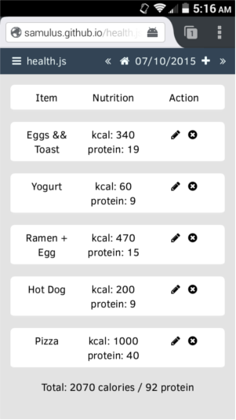

# health.js

A simple HTML5 / CSS3 / JS based calorie counting webapp designed to facilitate weight loss for users across a myriad of devices. 

Try it for yourself at: http://github.samulus.io/health.js
